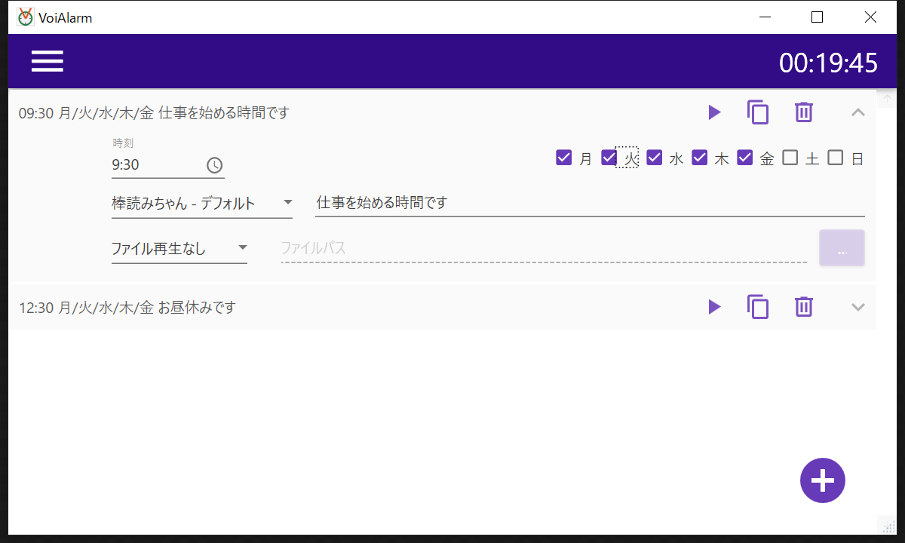

Sorry, this document is Japanese-only.

# VoiAlarm

CeVIO や棒読みちゃんによるボイス再生が可能なアラームです。
棒読みちゃんを経由することで、VOICEROID やいわゆる「ゆっくり音声」によるボイス再生も可能になります。

リモートワークのお供にいかがでしょうか？

# 使い方

VoiAlarm には CeVIO, 棒読みちゃんおよび棒読みちゃんが対応する VOICEROID などの音声合成ソフトウェアは **含まれておりません。**
VoiAlarm のユーザー様がご自身でこれらのソフトウェアを用意する必要があります。有償の製品の場合は、ご自身でお買いあげになる必要があります。

## CeVIO の利用

あらかじめ CeVIO をインストールしてください。
CeVIO を起動した状態で VoiAlarm を起動すると、アラームで CeVIO によるボイス再生が可能になります。

## 棒読みちゃんの利用

あらかじめ棒読みちゃんをインストールしてください。
棒読みちゃんを起動した状態で VoiAlarm を起動すると、アラームで棒読みちゃんによるボイス再生が可能になります。

棒読みちゃんが利用する TCP ポート番号を変更している場合は、VoiAlarm でも設定変更を行う必要があります。

# 動作確認環境

VoiAlarm は Windows アプリケーションです。Windows 10 Pro 1909 で動作確認を行っています。

# コントリビューション

不具合報告や要望は GitHub の issue という形でお願いします。
対応できない場合もありますので、あらかじめご了承ください。

# 注意事項

- 棒読みちゃんは、みちあき様によるフリーウェアです。
- CeVIO は CeVIO プロジェクト様による音声創作ソフトウェアです。
- VOICEROID は株式会社 AHS 様による音声合成ソフトウェアです。
- 各商品名、サービス名、会社名またはロゴマークは、各社の商標、登録商標もしくは商号です。

## OSS ライセンス表記

- [MaterialDesignInXamlToolkit](https://github.com/MaterialDesignInXAML/MaterialDesignInXamlToolkit/blob/master/LICENSE)
- [NAudio](https://github.com/naudio/NAudio/blob/master/license.txt)
